<div align="center">



</div>

---

```js
const night = {
  role: 'AI 应用产品工程师',
  tools: ['Prompt Engineering', 'JavaScript', 'React Native', 'CSS'],
  current: '用 AI 把想法变成可运行的产品',
  fact: '所有项目均以 AI 辅助开发为核心工作流'
};
```

<details>
<summary>📦 我做过的东西</summary>
<br>

| 项目 | 一句话介绍 |
|---|---|
| 🏆 **无障碍 CET-4 学习平台** | 面向听障群体的英语学习网站，AIGC 创新赛全国二等奖 |
| ⚡ **前端 IDE + AI 助手** | 在线代码编辑器 + 实时预览 + AI 代码生成 |
| 🎮 **霓虹方块** | React Native 方块游戏，6 模式 / 8 主题 / 技能树 |
| 📝 **知识笔记系统** | AI 驱动的笔记应用，Canvas 粒子背景 |

</details>

<details>
<summary>🏆 拿过的奖</summary>
<br>

- 🥈 中国高校计算机大赛 · AIGC 创新赛 — 全国二等奖 (2025)
- 🥇 CAD 制图竞赛 — 一等奖 (2024)

</details>

<details>
<summary>📫 找到我</summary>
<br>

打开一个 Issue 就行，或者看我的 pinned repos 玩玩。

</details>

---

<div align="center">
<sub>🤖 是的，我主要靠 AI 写代码。但产品是我想的，bug 也是我修的。</sub>
</div>
